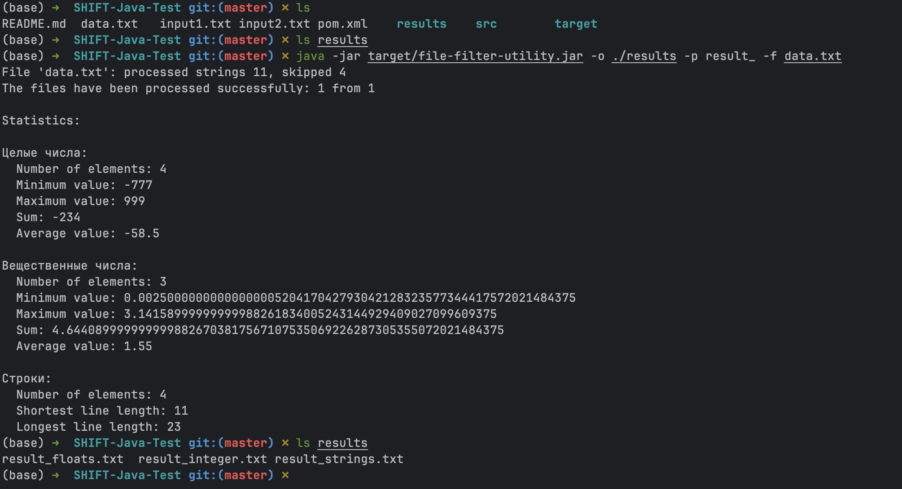
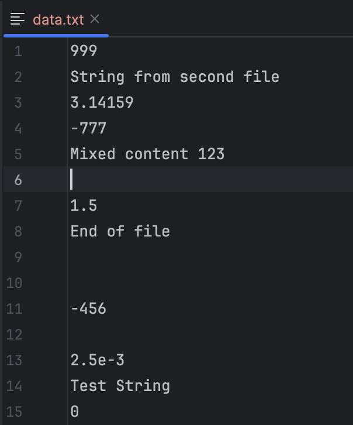
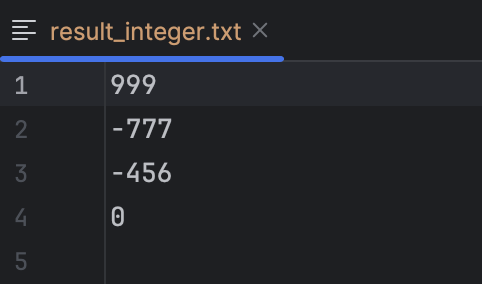
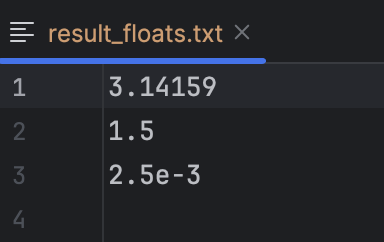
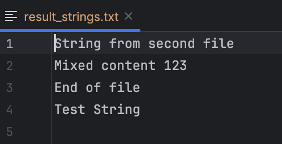

# File Filter Utility

Утилита для фильтрации содержимого файлов по типам данных (целые числа, вещественные числа, строки).

## Требования

- **Java версия**: 21 или выше
- **Система сборки**: Apache Maven 3.6.0 или выше

## Сборка проекта

```bash
mvn clean package
```

После сборки в папке `target/` будет создан файл `file-filter-utility.jar`.

## Запуск

```bash
java -jar target/file-filter-utility.jar [опции] файл1 файл2 ...
```

## Опции командной строки

- `-o <путь>` - Путь для выходных файлов (по умолчанию: текущая папка)
- `-p <префикс>` - Префикс имен выходных файлов (по умолчанию: пусто)
- `-a` - Режим добавления в существующие файлы (по умолчанию: перезапись)
- `-s` - Краткая статистика (только количество элементов)
- `-f` - Полная статистика (количество + дополнительная информация)

## Выходные файлы

По умолчанию создаются следующие файлы:
- `integers.txt` - целые числа
- `floats.txt` - вещественные числа
- `strings.txt` - строки

При использовании опций `-o` и `-p` имена файлов формируются как:
`<путь>/<префикс><тип>.txt`

## Статистика

### Краткая статистика (-s)
Показывает только количество элементов каждого типа.

### Полная статистика (-f)
- **Для чисел**: количество, минимум, максимум, сумма, среднее значение
- **Для строк**: количество, длина самой короткой и самой длинной строки

## Примеры использования

```bash
# Базовое использование с краткой статистикой
java -jar target/file-filter-utility.jar -s input1.txt input2.txt

# Вывод в указанную папку с префиксом и полной статистикой
java -jar target/file-filter-utility.jar -o /tmp -p result_ -f data.txt

# Режим добавления в существующие файлы
java -jar target/file-filter-utility.jar -a -s input.txt

# Обработка нескольких файлов с выводом в подпапку
java -jar target/file-filter-utility.jar -o output -f file1.txt file2.txt file3.txt
```

### Пример
#### Terminal view
]
#### data.txt(input file)

#### result: integers

#### result: floats

#### result: strings


## Классификация данных

- **Целые числа**: последовательности цифр, возможно со знаком (например: 123, -456, 0)
- **Вещественные числа**: числа с десятичной точкой или экспоненциальной записью (например: 3.14, -2.5, 1.23e-4)
- **Строки**: все остальные данные, включая текст и числа в нестандартном формате

## Обработка ошибок

Утилита продолжает работу даже при возникновении ошибок:
- Недоступные или несуществующие файлы пропускаются с выводом сообщения об ошибке
- Поврежденные строки в файлах пропускаются
- Ошибки записи в выходные файлы обрабатываются с сохранением частичных результатов

## Особенности реализации

- Пустые строки и строки содержащие только пробелы игнорируются
- Выходные файлы создаются только при наличии соответствующих данных
- Все числа обрабатываются с высокой точностью (используется BigDecimal для статистики)
- Буферизованный ввод/вывод для эффективной обработки больших файлов
- Автоматическое создание выходных директорий при необходимости

## Структура проекта

```
src/
├── main/
│   └── java/
│       └── com/
│           └── filefilter/
│               ├── FileFilterUtility.java      # Главный класс
│               ├── config/
│               │   ├── Configuration.java      # Конфигурация
│               │   └── ArgumentParser.java     # Парсер аргументов
│               ├── data/
│               │   ├── DataType.java          # Типы данных
│               │   └── DataClassifier.java    # Классификатор
│               ├── output/
│               │   └── FileWriterManager.java # Менеджер записи
│               ├── processor/
│               │   └── FileProcessor.java     # Основной процессор
│               └── statistics/
│                   └── Statistics.java        # Сборщик статистики
└── test/
    └── java/
        └── com/
            └── filefilter/
                └── # Тестовые классы (можно добавить)
```

## Тестирование

Создайте тестовые файлы для проверки работы утилиты:

**input1.txt:**
```
123
3.14
Hello World
-456
2.5e-3
Test String
0
```

**input2.txt:**
```
789
-1.23
Another String
42
```

Запуск:
```bash
java -jar target/file-filter-utility.jar -f input1.txt input2.txt
```

Результат:
- `integers.txt`: 123, -456, 0, 789, 42
- `floats.txt`: 3.14, 2.5e-3, -1.23
- `strings.txt`: Hello World, Test String, Another String

## Зависимости

Проект использует только стандартные библиотеки Java, дополнительных зависимостей не требуется.

Для тестирования используется:
- JUnit Jupiter 5.9.2 (scope: test)
